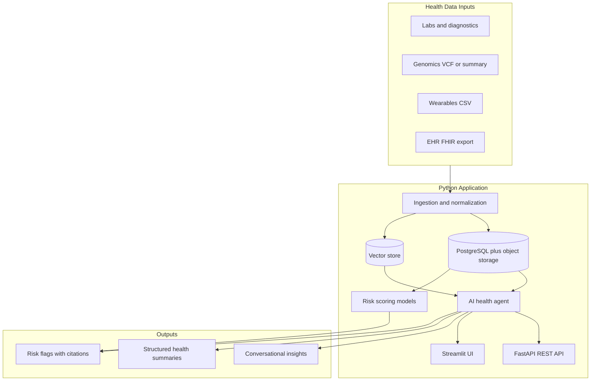

# AI Personalized Medicine

An educational **Python** project exploring how intelligent agents and modern diagnostics can enable personalized healthcare — from risk assessment to treatment insights.

> **Disclaimer:** This is a learning project, not a medical device or clinical tool. Nothing here constitutes medical advice. Do not use outputs for real health decisions without consulting a qualified healthcare provider.

---

## What This Project Is About

Personalized medicine tailors prevention, diagnosis, and treatment to an individual's biology, history, and lifestyle — rather than applying one-size-fits-all protocols.

Three forces are making this practical at scale:

1. **Abundant personal health data** — genome scans, lab panels, EHR records, and wearables generate rich, longitudinal signals about each person.
2. **Plummeting diagnostic costs** — genome sequencing has dropped faster than Moore's law; new tests enable earlier detection of disease markers.
3. **Personalized therapies** — mRNA and other delivery vectors make patient-specific treatments increasingly feasible, with regulatory pathways evolving.

**Intelligent agents** sit at the center of this shift. Instead of static dashboards, an agent can:

- Ingest heterogeneous health data (PDF lab reports, VCF genomics files, FHIR EHR exports, CSV wearables)
- Reason over medical literature and structured knowledge bases
- Answer patient-specific questions with citations and uncertainty
- Flag risks, anomalies, and follow-up questions for clinician review

This repository is a **hands-on Python sandbox** to learn AI by building pieces of that ecosystem — starting simple, growing in complexity.

---

## What We're Building

A modular Python platform with four core capabilities, implemented incrementally:

| Module | Purpose | Learning focus |
|--------|---------|----------------|
| **Data ingestion** | Parse labs, genomics snippets, wearables CSV | Data engineering, schema design |
| **Knowledge + RAG** | Index guidelines, PubMed abstracts, drug info | Embeddings, retrieval, chunking |
| **Health agent** | Chat over *your* data with tool use | LLM agents, prompt design, safety |
| **Risk & insights** | Simple ML baselines + agent explanations | Classical ML + interpretability |

### High-level architecture



---

## Tech Stack (Python)

The entire project is built in **Python 3.11+** — backend, AI/ML, agents, and UI.

### Core

| Layer | Choice | Why |
|-------|--------|-----|
| **Language** | Python 3.11+ | Dominant ML/AI ecosystem; one language end-to-end |
| **API** | [FastAPI](https://fastapi.tiangolo.com/) | Async, typed, auto-generated OpenAPI docs |
| **UI** | [Streamlit](https://streamlit.io/) | Pure Python frontend for rapid prototyping |
| **Agent framework** | [LangGraph](https://langchain-ai.github.io/langgraph/) or [Pydantic AI](https://ai.pydantic.dev/) | Tool-calling agents with explicit control flow |
| **LLM** | OpenAI / Anthropic API (or Ollama locally) | Start with APIs; swap to local models later |
| **Embeddings + RAG** | [ChromaDB](https://www.trychroma.com/) or pgvector | Simple local vector store; pgvector scales with Postgres |
| **Database** | PostgreSQL + [SQLAlchemy](https://www.sqlalchemy.org/) | Structured patient data, JSONB for flexible records |
| **ML** | scikit-learn, pandas, XGBoost | Classical ML before deep learning |
| **Validation** | [Pydantic](https://docs.pydantic.dev/) | Typed schemas for patients, labs, and API payloads |

### Supporting tools

- **[uv](https://docs.astral.sh/uv/)** — fast Python dependency and virtualenv management
- **Docker** — PostgreSQL and other services via Compose
- **pytest** — testing
- **Ruff** — linting and formatting
- **Jupyter** — experiments and EDA in `notebooks/`

### Data sources (public, for learning)

- [1000 Genomes](https://www.internationalgenome.org/) — genomics
- [MIMIC-IV](https://physionet.org/content/mimiciv/) — de-identified EHR (requires credentialing)
- [OpenSNP](https://opensnp.org/) — consumer genomics
- Synthetic patient generators — safest starting point

---

## Project Structure

```
ai-personalized-medicine/
├── README.MD
├── pyproject.toml              # Python dependencies and project config
├── .env.example                # Environment variable template
├── .gitignore
├── docker/
│   └── docker-compose.yaml     # PostgreSQL and other services
├── backend/                    # Core Python application
│   ├── api/                    # FastAPI routes and app entrypoint
│   ├── agents/                 # Health agent + tools
│   ├── db/                     # Database connection and sessions
│   ├── ingestion/              # Parsers for labs, VCF, CSV
│   ├── ml/                     # Risk scoring models
│   ├── rag/                    # Document indexing and retrieval
│   └── models/                 # Pydantic and SQLAlchemy schemas
├── frontend/                   # Streamlit UI (Python)
│   └── app.py
├── scripts/                    # CLI utilities (e.g. generate synthetic data)
├── data/
│   ├── synthetic/              # Fake patients for dev
│   └── knowledge/              # Guidelines, sample literature
├── notebooks/                  # Jupyter notebooks for exploration
└── tests/                      # pytest test suite
```

---

## Learning Roadmap

Build in phases. Each phase teaches distinct AI skills.

### Phase 1 — Foundation (Week 1–2)
- [ ] Set up Python project (`pyproject.toml`), FastAPI hello-world, Docker Compose
- [ ] Define patient schema (demographics, labs, variants, vitals) with Pydantic
- [ ] Generate 10–50 synthetic patient records
- [ ] Build a simple REST API: upload CSV → store in Postgres

**You learn:** API design, data modeling, SQL, Python project layout

### Phase 2 — RAG over medical knowledge (Week 3–4)
- [ ] Chunk and embed sample guidelines (e.g., CDC, NIH fact sheets)
- [ ] Implement semantic search: "What does elevated LDL mean?"
- [ ] Add citation links in responses

**You learn:** Embeddings, chunking strategies, retrieval quality

### Phase 3 — Health agent (Week 5–7)
- [ ] Agent with tools: `get_patient_labs`, `search_knowledge`, `calculate_bmi`
- [ ] Multi-turn chat grounded in one synthetic patient's data
- [ ] Guardrails: refuse diagnosis, always cite sources, express uncertainty

**You learn:** Tool use, agent orchestration, prompt engineering, safety

### Phase 4 — Risk scoring (Week 8–9)
- [ ] Train a simple classifier (e.g., diabetes risk from labs + demographics)
- [ ] Have the agent *explain* model output in plain language
- [ ] Compare ML prediction vs. agent-only reasoning

**You learn:** Feature engineering, model evaluation, AI + ML hybrid systems

### Phase 5 — Polish (Week 10+)
- [ ] Streamlit UI wired to the FastAPI backend
- [ ] PDF lab report parser
- [ ] Evaluation harness (golden Q&A pairs)
- [ ] Write-up: what worked, what didn't

**You learn:** Full-stack Python integration, evaluation, product thinking

---

## Getting Started

### Prerequisites

- Python 3.11+
- [uv](https://docs.astral.sh/uv/getting-started/installation/) (recommended) or pip
- Docker (for PostgreSQL)
- An LLM API key (OpenAI, Anthropic) or [Ollama](https://ollama.com/) for local models

### Quick start

```bash
# Clone the repo
git clone https://github.com/KarthikAmaravadi1234/ai-personalized-medicine.git
cd ai-personalized-medicine

# Create virtualenv and install dependencies
uv sync

# Copy environment template and fill in values
cp .env.example .env

# Start PostgreSQL
docker compose -f docker/docker-compose.yaml up -d

# Run the API
uv run uvicorn backend.api.main:app --reload

# Run the Streamlit UI (separate terminal)
uv run streamlit run frontend/app.py
```

API docs are available at `http://localhost:8000/docs` once the server is running.

---

## Data tooling

### Synthetic patient data

`scripts/generate_synthetic_patients.py` produces clinically *correlated* fake patients: a
shared latent metabolic-risk factor drives glucose, HbA1c, lipids, BMI, and blood pressure
together (HDL inversely), with derived condition labels and optional longitudinal visits.

```bash
# Generate 40 patients, 3 visits each, reproducible
python scripts/generate_synthetic_patients.py --count 40 --seed 7 --visits 3
# Outputs: data/synthetic/{patients.json, patients.csv, cohort_labeled.csv}

# Load them into the database (so the API + web UI show realistic data)
python scripts/seed_db.py --clear
```

`cohort_labeled.csv` holds the ML feature columns (`age, bmi, fasting_glucose, hba1c, ldl,
systolic_bp`) plus a `diabetes_label`, aligned with `backend/ml/features.py`.

### Knowledge base (RAG corpus)

`scripts/fetch_knowledge.py` pulls attributed content from open sources into
`data/knowledge/<slug>.md` (with YAML frontmatter provenance), plus a `manifest.json` and
`ATTRIBUTION.md`. It is a manual, network-using tool; the app and tests stay offline.

```bash
python scripts/fetch_knowledge.py --topics data/knowledge_topics.json --reindex
```

- Sources: `wikipedia` (CC BY-SA 4.0, default, plain-text extracts) and `medlineplus`
  (U.S. NLM, largely public domain). Edit `data/knowledge_topics.json` to add topics.
- The retriever strips the frontmatter before chunking, so provenance metadata never
  pollutes embeddings. Re-index with `--reindex` or `POST /knowledge/reindex`.
- Optional `beautifulsoup4` (the `data` extra) enables richer HTML cleaning.

### Embedding backends

Retrieval quality depends on the embedder, selected via `EMBEDDING_BACKEND`
(`auto` | `sentence_transformers` | `openai` | `local`; default `auto`):

- `local` — dependency-free lexical (hashing + IDF). Always available; modest accuracy.
- `sentence_transformers` — local semantic model (accurate, offline). Install with
  `pip install -e ".[embeddings]"`; the first run downloads `all-MiniLM-L6-v2` (~90MB).
- `openai` — OpenAI embeddings (needs `OPENAI_API_KEY` and quota).
- `auto` — prefers `sentence_transformers` when installed, then OpenAI, then `local`.

Switching backends changes the vector space, so restart the API (or `POST
/knowledge/reindex`) afterward to rebuild the index.

> This corpus is assembled for educational use only and is not medical advice. Respect each
> source's license; Wikipedia content remains under CC BY-SA 4.0 (see `ATTRIBUTION.md`).

---

## Key Design Principles

1. **Python everywhere** — backend, ML, agents, and UI all in one language.
2. **Synthetic data first** — never commit real PHI; use fakes until you understand privacy (HIPAA) requirements.
3. **Citations over confidence** — every health claim should trace to a source or patient record field.
4. **Human in the loop** — agents suggest; clinicians (or you, in dev) validate.
5. **Modular packages** — separate ingestion, retrieval, reasoning, and reporting into testable units under `backend/`.
6. **Evaluate continuously** — maintain a small set of question/answer pairs and score retrieval + response quality.

---

## Safety and Ethics

- Do **not** deploy this for real patients without legal, clinical, and security review.
- Be explicit that outputs are **informational**, not diagnostic.
- Log agent reasoning for auditability.
- Understand bias in training data and knowledge bases.
- Read [FDA guidance on AI/ML in SaMD](https://www.fda.gov/medical-devices/software-medical-device-samd/artificial-intelligence-and-machine-learning-software-medical-device) if you go beyond learning.

---

## Inspiration

This project explores the thesis that **abundant personal data + intelligent agents + cheaper diagnostics and therapies** will reshape care delivery — enabling patients to better understand risk and access personalized treatments. The startup ecosystem will span ingestion, interpretation, trial matching, therapy design, and care coordination. This repo is one learner's entry point into that world.

---

## License

TBD — add a license before open-sourcing (MIT recommended for learning projects).

## Contributing

This is primarily a personal learning project. Issues and ideas welcome.
